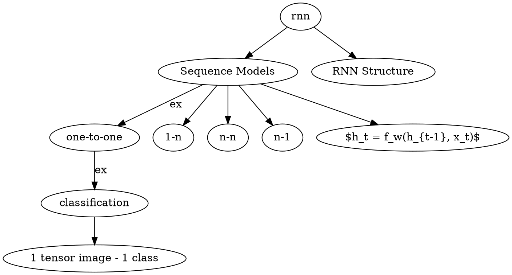

---
headers-include:
  - abc.tex
output:
pdf_document:
path: outputs/overview.pdf
---

# Overview RNN



```latex {cmd}
\documentclass{standalone}
\usepackage[pdf]{graphviz}

\begin{document}
\digraph[scale=0.5]{abc}{
    seq [label = "Sequence Models"]
    str [label = "RNN Structure"]

    rnn -> seq
    rnn -> str

    seq -> "one-to-one" -> classification [label=ex]
    classification -> "1 tensor image - 1 class"
    seq -> "1-n"
    seq -> "n-n"
    seq -> "n-1"
    seq -> hidden_rnn_layer

    hidden_rnn_layer [label="h_t = f_w(h_{t-1}, x_t)"]

}
\end{document}
```
