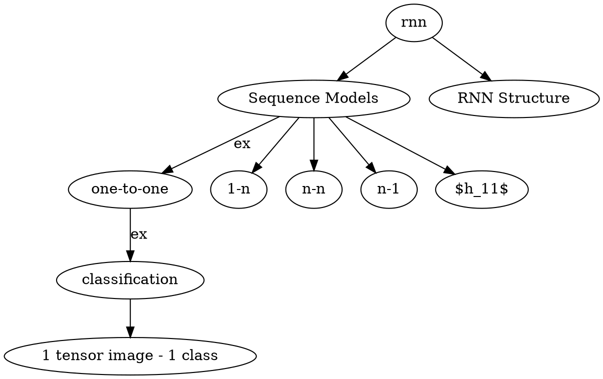

# Overview RNN

```dot

digraph G {
    seq [label = "Sequence Models"]
    str [label = "RNN Structure"]

    rnn -> seq
    rnn -> str

    seq -> "one-to-one" -> classification [label=ex]
    classification -> "1 tensor image - 1 class"
    seq -> "1-n"
    seq -> "n-n"
    seq -> "n-1"
    seq -> hidden_rnn_layer


    hidden_rnn_layer [texlbl="$h_t = f_w(h_{t-1}, x_t)$" label="$h_11$"]
}

```

$$
    \digraph[scale=0.5]{abc}{
        b [ shape=none label=abc ];

        a -> b -> c;

    }
$$
