# Recurrent Neural Networks

- Basic of RNN
- Models in RNN
- Introduction to Vanilla RNN
  - rolled vs unrolled (unfolded)

## Sequence Models

- one-to-one
  - 1 `tensor` --f--> 1 tensor
    - classification:
      - 1 input image -> class
    - regression
      - next value of sales
- one-to-many (or _sequence_)
- many-to-one
  - unknown length of input -> 1 output
- many-to-many (or _sequence-to-sequence_)
  - arbitrary length
    - sequence of possibly different lengths
    - sequence of same length
      `(? input # output ?)`

## Mathematical

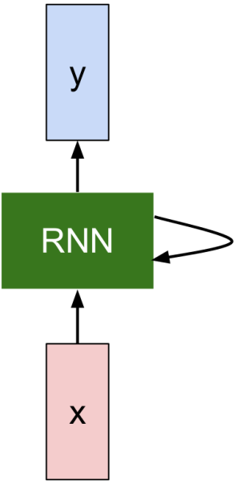

> $h_t = f_w(h_{t-1}, x_t)$

- Hidden state $h \in R^K$
- Function $f_w$ a folded network
  - `unfolded or unrolled` -> `multiple layers`
  - `same W` in all time steps
- Output $y_t$ is a function of **only** hidden state $h_t$
  - also, `same weights->output`
  - Output of previous layer, $y_{t-1}$ is `appended` to input at $x_t$
    - $y_t = y_{t-1} + W * X_t = W_{hy}h_t$

Example:

> $h_t = \tanh(W_{hh} h_{t-1} + W_{xh} * X)$ > $y_t = W_{hy} * h_t$

## Computational graph

An RNN is `unfolded` in time

- to generate a `standard feed-forward computational graph`
  - also to support back propagation

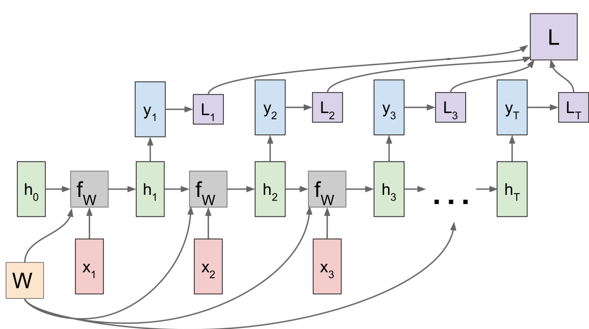

### Case 1: many-to-many

- Weights
  - W same for X -> $f_W$
- Inputs
  - X might stop at some point
- Outputs
  - Y continue until final state
- Loss
  - Each output -> each Loss
  - Total loss = sum all

### Case 2: many-to-one

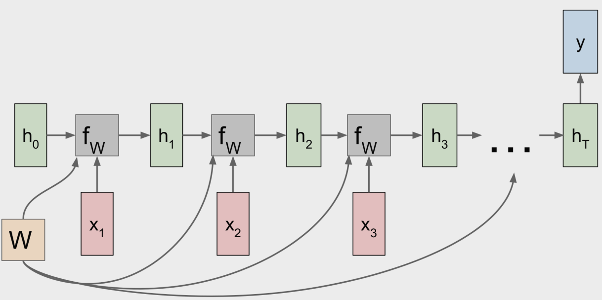

### Case 3: one-to-many

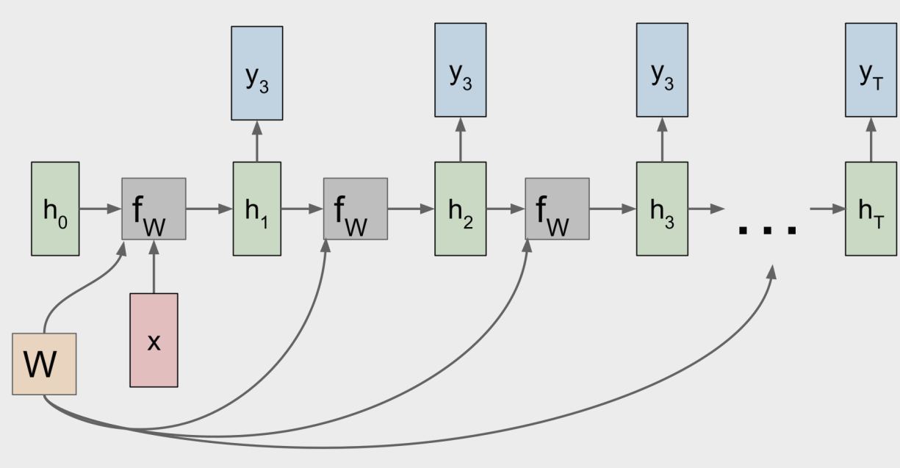

### Case 4: encoder-decoder view

Popular in translation

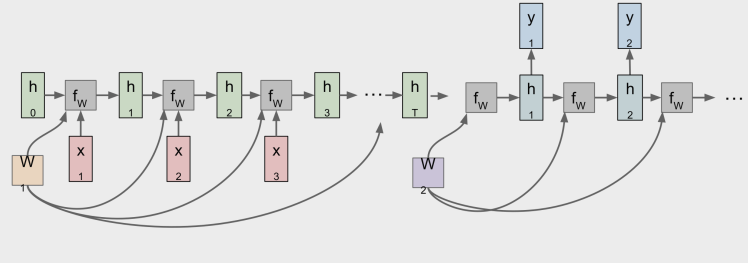

- Encoder: many-to-one
  - encode input sequence to terminal state $h_t$
- Decoder: one-to-many
  - decode into another sequence

### Example

Given input $X_t$, estimate next character $y_t$

Assume we have fixed domain A = {h, e, l, o}

- hence, $x_t, y_t \in R^4$
- A --transformed--> `one-hot-encoding` vector
- rnn cell = vanilla

#### Hidden Layer - Activation Function

> $h_t = tanh(W_{hh}h_{t-1} + W_{xh}x_t)$

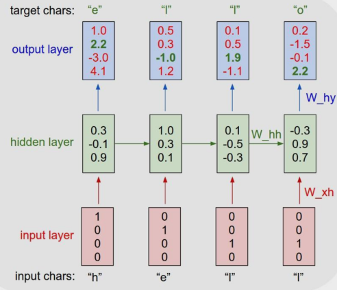

#### Loss Function

> loss = logistic regression loss for classification

#### Training (unfolding + backprop)

If over all training set it will look like:

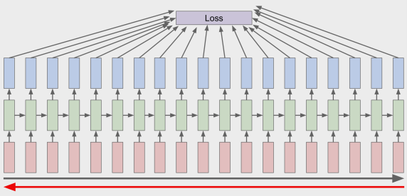

- Problems: whole data set
  - forward through entire sequence to compute loss
  - backward also through entire sequence to compute gradient

Solved by **truncated backprop**

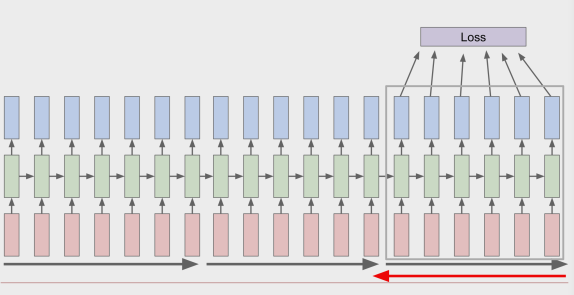

- Each chunk as a window = chunk of sequence
- Forward
  - carry hidden states forward in time forever
- Backprop
  - only for a window

#### Prediction and Generation of a sequence

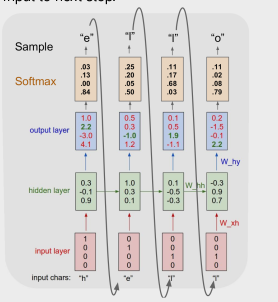

- input could stop here at 4, but it could auto generate next other outputs
  - reused to generate next outputs
  - next output = next input

### Depth in RNN

- How to get "**depth**" into RNN

  - **already deep**
    - RNN is a `virtue of propagation`
      - if unfolded -> many time steps

- More complex multilayer RNN
  - more complex in non-linear dependencies of output on input

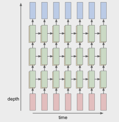

$$
  h_t^l = tanh(W_l\begin{bmatrix}h_t^{l-1} \\ h_t^{l}\end{bmatrix})
$$

where

- $h_t^0 = x_t$
- $W_l$ same for ever time step of the layer l

- How to construct deep rnn
  - by replacing
    1. input-to-hidden function
    1. hidden-to-hidden-transition
    1. hidden-to-output-function

## Explaining RNN - visualization and understanding

> Idea: Search for **cells** with high-level of interpretation

> !!! The following examples will have
>
> - blue ~ strongly negative factor
> - white ~ neutral
> - red ~ strongly positive

### Examples of an output of a cell (or hidden layer) and its feature:

#### the cell explains nothing

(low-interpretable level)

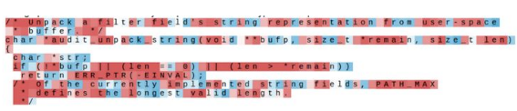

#### the cell extract quoting

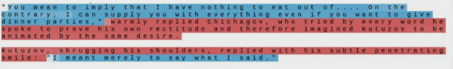

- if quoting then negative (blue)
- if non-quoting then positive (red)

#### the cell explain length of lines

! More examples in feature extractions for coding like (commenting, if-else statement, nesting length )
