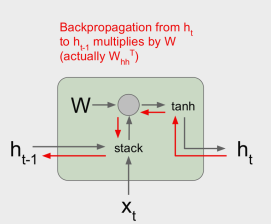
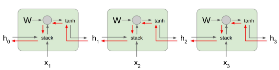

# RNN Cell Structure

- Vanilla RNN basic cell
- Long-short-term-memory (LSTM)
- Gate Recurrent Unit (GRU)

## Vanilla RNN gradient flow

$$
  h_t = tanh(W_{hh}h_{t-1} + W_{xh}x_t)
  \equiv tanh(\begin{bmatrix}
                W_{hh} & W_{xh}
              \end{bmatrix}.
              \begin{bmatrix}
                h_{t-1} \\ h_{t}
              \end{bmatrix}
            )
  \equiv tanh(W.\begin{bmatrix}h_{t-1} \\ h_{t}\end{bmatrix})
$$

Single-step



3-steps



### Problem of Vanilla and long-steps

- to computing gradient $h_0$
  - involves many factors of W
    - repeated tanh
  - leads to
    - **Exploding gradients** if largest singular value > 1
      - but can solved by **gradient clipping**
    - **Vanishing gradients** if largest singular value < 1
      - not easy -> we use LSTM
  - more steps -> more chance to this happen

#### Gradient clipping

Scale gradient if its norm is too big or said if grad is larger than a $threshold$

> $grad = grad * scale\_factor$

- with $scale\_factor = \frac{threshold}{\sum{grad}²}$

```python
grad_norm = np.sum(grad * grad)
if grad_norm > threshold:
  grad = grad * (threshold / grad_norm)
```

## LSTM

## GRU
