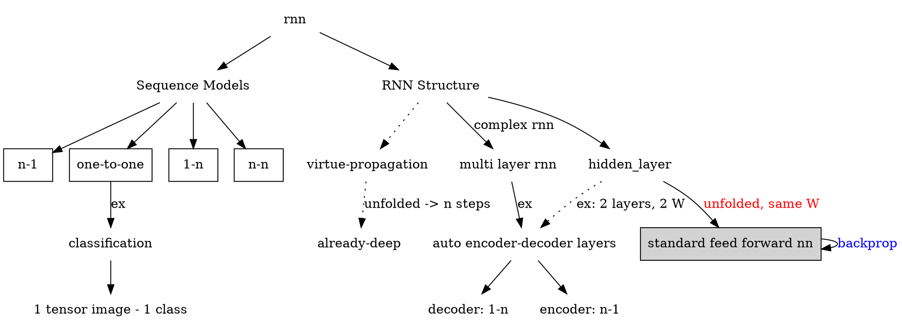
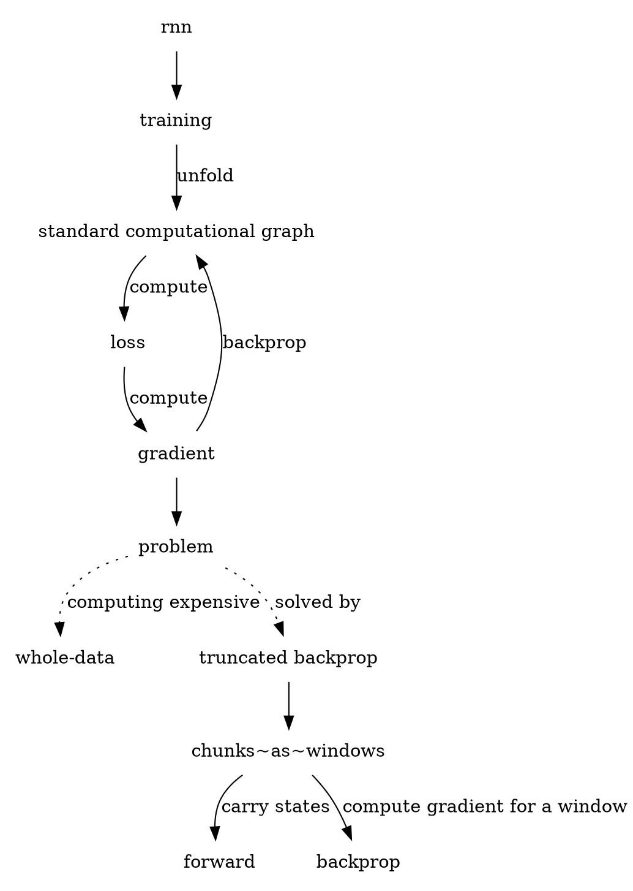

# Overview RNN

## Hidden Layer

$y_t = W_{hy} * h_t$

- $y_t = y_{t-1} + W * X_t = W_{hy}h_t$

$h_t = f_w(h_{t-1}, x_t)$

- ex: $h_t = \tanh(W_{hh} h_{t-1} + W_{xh} * X) = = tanh(W\begin{bmatrix}h_{t-1} \\ X\end{bmatrix})$

- Generally
  $ h_t^l = tanh(W_l\begin{bmatrix}h_t^{l-1} \\ h_t^{l}\end{bmatrix})$

