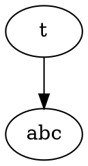

# How to draw latex-enabled graph with markdown

## [code-chunk] enabled in markdown-preview-enhanced

1. `markdown-preview-enhanced.enableScriptExecution`: true
   - Notice: you also may add -shell-escape for some packages like graphviz
     `"markdown-preview-enhanced.latexEngine": "pdflatex -shell-escape"`
1. use \```latex {cmd=true}``` or simply with {cmd hide}
   - Notice: failed to use {cmd=true args=[...]} in latex
1. example

   ```latex {cmd args=["--shell-escape"]}

   \documentclass{standalone}
   \usepackage[pdf]{graphviz}

   \begin{document}
   Hello World!

   \digraph[scale=0.5]{abc}{
       b [ shape=none label="$b_1$" ];

       a -> b -> c;

   }
   \end{document}
   ```

[code-chunk]: https://github.com/shd101wyy/markdown-preview-enhanced/blob/master/docs/code-chunk.md

## Use UTF8 directly in dot for simple math notation

Here we use `\&#946;` (&#946;)

```dot
digraph threevar {
      rankdir=LR;
      size="8,4";
      node [fontsize=14 shape=box];
      edge [fontsize=10];
      center=1;
      {rank=min k }
      {rank=same X1 X2 X3 }
      {rank=max z1 z2 z3 }
      z1 [shape=circle label="&#946;1"];
      z2 [shape=circle label="&#946;2"];
      z3 [shape=circle label="&#946;3"];
      k [label="?" shape="ellipse"];
      k -> X1 [label="?1"];
      k -> X2 [label="?2"];
      k -> X3 [label="?3"];
      z1 -> X1;
      z2 -> X2;
      z3 -> X3;
    }
```



## External Dot file

- Currently a dot included another dot file does not work with graphviz (may be 3rd extension)

## Mathjax and AMS

1. Enable Mathjax

   ```json
   "markdown-preview-enhanced.mathRenderingOption": "MathJax",
   ```

1. Disable other extensions in vscode also using Mathjax

1. Rendering graph using AMS package
   you also may check if extension is loaded by `ctrl+ship+p` -> Markdown Preview Enhanced: Open Mathjax configure

   ```latex
   $$
   \require{AMScd}
   \begin{CD}
       A_5 @= A_6 \\
       @V?VV @AA!A \\
       B @>f>> C \\
       @V?VV @AA!A
   \end{CD}
   $$
   ```

   $$
   \require{AMScd}
   \begin{CD}
       A_5 @= A_6 \\
       @V?VV @AA!A \\
       B @>f>> C \\
       @V?VV @AA!A
   \end{CD}
   $$



## Mathjax or KaTex include external tex files

- Currently not supported or unknown
