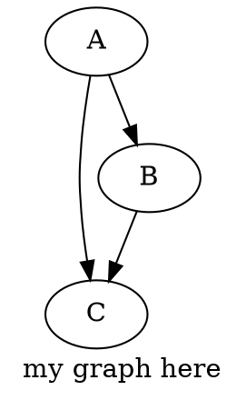

## Pandoc + Markdown + Latex + Graphviz

1. set in settings.json

   ```json
   "markdown-preview-enhanced.usePandocParser": true,
   ```

1. Example



**Notice**:

- Failed: not good solution for markdown + math
  - katex does not support tikz (generated by dot2tex)
  - dot2tex filter failed
- Need: render (1) katex -> (2) dot (viz.js)
