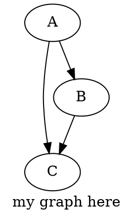

## Pandoc + Markdown + Latex + Graphviz

1. set in settings.json

   ```json
   "markdown-preview-enhanced.usePandocParser": true,
   ```

   **Notice**: it will replace default markdown-it parser

1. Example



Notice:

- currently doc2tex filter failed with pandoc -> need to rewrite
- find the way to render (1) katex -> (2) dot (viz.js)
- not good solution for markdown + katex-graph
