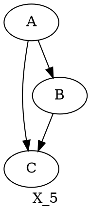

## Pandoc + Markdown + Latex + Graphviz

1. set in settings.json

   ```json
   "markdown-preview-enhanced.usePandocParser": true,
   ```

   **Notice**: it will replace default markdown-it parser

1. Example



Notice:

- currently filter failed
- find the way to render (1) katex -> (2) dot (viz.js)

## Alternative with dot2tex (ugly)

1. use dot2tex -> convert to tex
1. copy from \begin{tickzpicture} ... \end{tickzpicture} to $$...$$
1. use pandoc to generate pdf/rendering
